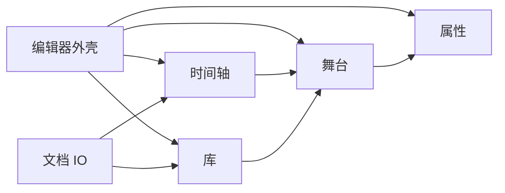

# 系统设计

## 子系统协作

## 与概念阶段一致性

产品愿景与范围见 `00-concept/product-design.md`；本系统实现 **单页 Web 编辑器** 子集，对应物理目标 `flash-editor-web`。

## 与物理阶段对应

- 对外可验证行为（帧率、面板布局、打开 XFL 检测结果）以 `02-physical/flash-editor-web/spec.md` 为准。
