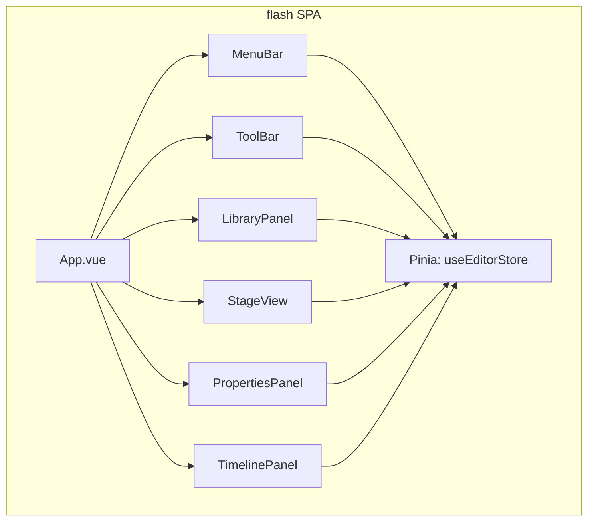

# UML 组件图（Mermaid）

```mermaid
flowchart TB
  subgraph SPA[flash SPA]
    App[App.vue]
    MB[MenuBar]
    TB[ToolBar]
    Lib[LibraryPanel]
    St[StageView]
    Pr[PropertiesPanel]
    TL[TimelinePanel]
    Store[Pinia: useEditorStore]
  end

  App --> MB
  App --> TB
  App --> Lib
  App --> St
  App --> Pr
  App --> TL
  MB --> Store
  TB --> Store
  Lib --> Store
  St --> Store
  Pr --> Store
  TL --> Store
```
